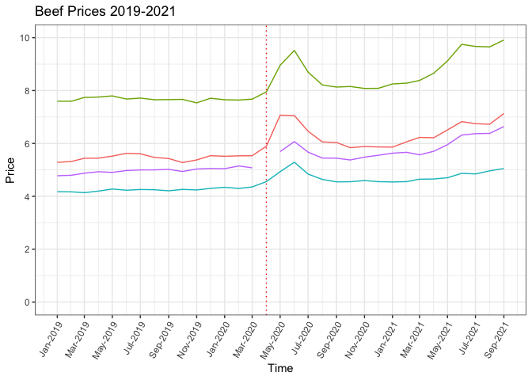
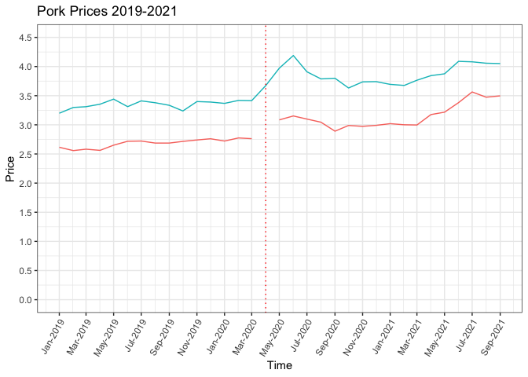

# Introduction

A few weekends ago, I was scrolling through one of my favorite food
blogs and came across a wonderful recipe for lasagna. I only needed a
few ingredients so I headed to the store. When I arrived at the checkout
line with a small basket of items, I was shocked when my total was $37!
Recently, it seems that every time I leave the store, I am dumbfounded
at the amount of grocery bags I unpack relative to the number at the
bottom of the receipt and I am likely not the only one. On November
10th, the Department of Labor announced the Consumer Price Index (CPI)
summary which shows the level of inflation on a yearly basis. The CPI
increased 6.2% overall since this time last year. The CPI for food
purchased from grocery stores has increased by 5.4% in the last year,
meaning that food items cost 5.4% more than they did last year.   To
understand where these increases in food prices come from, we need to go
back to the start of the pandemic. When President Trump declared a
nation-wide state of emergency on March 13th, 2020, we were already
observing shortages in things such as cleaning supplies, bottled water,
non-perishable foods, hand sanitizer, medicine, and of course, toilet
paper due to COVID-19. The lines at grocery stores were spinning out of
control as panic-induced demand took hold. Throughout the month of March
and into April food shortages were reported across the United States; on
March 2nd the Washington Post published an article entitled, “Long
lines, low supplies: Coronavirus chaos sends shoppers into panic-buying
mode” and on March 16th, the New York Times reported “Panicked Shoppers
Empty Shelves as Coronavirus Anxiety Rises”, along with many other news
sources publishing similar headlines. Disruptions to global and local
supply chains closely followed the sudden increase in demand as the
Coronavirus spread and created upward pressure on prices in the retail
food industry. As Americans struggle with the economic and health
impacts of the crisis, the sudden increase in food prices has burdened
the American family even further. The food insecurity rate doubled in
2020 due to the increase in unemployment, school closures, and elevated
food prices. The increased food prices have a big impact on individuals
and families because Americans spend, on average, 10% of their personal
disposable income (DPI) on food, with 4.7% spent on food purchased from
restaurants and 4.9% spent on food purchased at grocery stores in 2019.

# Data

The Bureau of Labor Statistics (BLS) tracks labor market activity,
working conditions, productivity in the economy, and prices. A common
measure of price inflation is called the Consumer Price Index (CPI)
which is calculated by dividing the price of a basket of items that the
average U.S. household consumes in one month by the same basket in
another month multiplied by 100 which creates an index of price. The BLS
uses survey information from American families to determine what
constitutes “the average basket of goods” and then CPI data collectors
head to their local grocery store and note the prices of each item. The
CPI is different for urban and non-urban consumers, and in this analysis
I have chosen to use data for urban consumers considering that 93% of
the US population lives in urban areas. I am using their monthly reports
of average prices on specific food items and the overall CPI for food
purchased for at-home consumption (Food At Home) and food purchased from
restaurants (Food Away). I have selected average price data for products
that fall into these main categories: beef, pork, poultry, eggs, and
dairy. I chose the items within those categories based on whether the
prices dated back to the early 2000s and the relevance of them to the
category. For example, I did not include ice cream prices in the dairy
category because milk and eggs are the main ingredients in ice cream so
we can understand a general trend in dairy prices without including ice
cream. In the meat categories, I have pulled prices for the cuts of meat
that include all qualities of meat and had price information in my
target time period.

# What is happening to prices for food over time?

Using the CPI data from the Bureau of Labor Statistics (BLS), we can see
that the CPI for Food At Home increased by 7.5 or a 5.1% increase in CPI
between March 2020 and October 2021. For Food Away, the CPI increased by
14.3 or a 4.9% increase during the same time period. The impact on Food
Away prices did not take into effect until after the initial lock-down
concluded. By August of 2020, Food Away prices had increased by roughly
4 as most restaurants were allowed to re-open at some capacity level
depending on state laws, but across March, April, and May the CPI
increased by 1 each month. As restaurants and the hospitality industry
shut down, their demand for food products disappeared so a reallocation
of food that would normally supply restaurants and hotels was required
to meet the demand coming from the retail food market. However, food
packaging requirements are different depending on which market the final
good is being sold in so manufacturers had to readjust their packing
procedures which especially impacted the meat, egg, and dairy
industries. Once restaurants were allowed to reopen, their prices began
to increase just like Food At Home prices.   In the early 2000s food
prices were relatively stable around 2.5% yearly inflation but between
2007 and 2008 food prices began to rise above the inflation rate for
other goods mostly due to increased demand driven by income increases.
Once the Great Recession took hold, food prices reflected the
deflationary pressures of the economy and by 2012, they had stabilized
again.<em> Note: the grey bar shows the Great Recession and the dotted
red line marks April 1st, 2020.</em>

The month-over-month change in CPI tells us the percent difference in
the CPI value from one month to the next. We can see that in April 2020
the CPI increased by 2.6% which was **the largest one-month increase in
the last 20 years** which is much worse than the volatility we observed
during the 2008 recession. The severity of this monthly spike emphasizes
the sudden impact of COVID-19 on both the demand and supply sides. After
the initial spike in food prices, the month-to-month change in CPI for
Food At Home lowered over May 2020 through November 2020 but then began
to rise again. The one-month change in CPI from September 2021 to
October 2021 was 1.2%, the largest one-month increase since April 2020.

# What food product experienced the largest increase in price?

In the latest report published by the BLS detailing the yearly price
changes, “the index for meats, poultry, fish, and eggs increased 11.9
percent, with the index for beef rising 20.1 percent and the index for
pork rising 14.1 percent, its largest 12-month increase since the period
ending December 1990.” Why are these food items experiencing such large
increases in price? In addition to the surge in demand for Food At Home
driving up prices, the meat industry also faced massive issues with
their workers becoming sick with COVID-19 which forced them to shut-down
plants. According to the Food and Environment Reporting Network, there
have been 59,148 COVID-19 cases among meatpacking workers since March
2020. Without a well-functioning meat processing plant, the supply of
meat products likely decreased, further driving up the price.   We do
not observe the exact same nominal price increases here because the BLS
uses a more comprehensive account of meat and dairy products, but the
increases we see below closely follow the trend described by the BLS.

Let’s exmaine the price trends of each type of product to get a better
idea of what is driving the price changes:

## Beef

Beef prices first spiked in April 2020 and hit a peak in June 2020
across all products. During this period, for example, beef steaks were
$7.95 per lb in May of 2020 and jumped to $9.52 per pound in June 2020.
Steak, roasts, and all other beef hit their highest prices in September
2021, following the upward trend in prices starting in the beginning of
2021. Beef is the most expensive type of product in our analysis and the
product that experienced the highest nominal price increase during the
pandemic.

## Pork

Pork prices follow a similar trend as beef but their increases are less
drastic than the changes in beef prices. All Other Pork experienced a
price increase from $3.20 per pound to $3.40 between May and June 2021
and pork chops increased from $3.90 per pound to $4.10 per pound. There
is a slight upward trend starting in the beginning of 2021, for example
All other pork reached its highest point in July 2021 at over $3.50 per
lb.

## Poultry

Considering poultry now, the price increases seen here are much less
noticeable than with pork and beef. There was relatively small nominal
price increase in April 2020 for Boneless Chicken Breast and almost no
nominal price increase for Bone-in Chicken Legs. The reason for this
could be driven by the demand for poultry before the pandemic and the
processing procedures for poultry. The poultry industry differs in that
processing the meat is much less labor intensive so there is less
contact with workers – an important factor when a global pandemic hits.
It could also be driven by the way that poultry is farmed and shipped
across the US.   We observe an increase in April 2020 and in June
2020, along with a small increase between winter 2021 and summer 2021.
For example, the price of Chicken Breast went from $3.20 per pound in
February 2021 to $3.50 per pound in August 2021.

## Eggs

Eggs play an interesting role in this exploration because eggs serve as
protein-rich substitute for meats. So when we see an increase in the
price of beef driven mostly by supply chain issues, like was the case
when COVID-19 hit, we also observe an increase in demand for the close
substitutes of meat – ie eggs. That is what we see here: the price of
eggs increased from $1.50 per dozen to $2.00 per dozen in April 2020.
Why do we observe the largest nominal price increase for eggs in April
2020 rather than in June, like we saw with poultry prices? Two possible
explanations: 1) people substitute away from expensive proteins to the
relatively cheaper choice of eggs, 2) the shelf life of eggs is much
longer than meat products so when buying food in an emergency, eggs
would appear to be a safer choice.   The price tapered off quickly
after April 2020 but began to rise again in the summer of 2021 to over
$1.50 per dozen.

## Dairy

Prices of dairy products follow each other closely with a steady rise in
price since approximately 2018 and the spike in April 2020 is barely
discernible even when looking closely at the prices of milk and cheese
(butter prices do not extend into our smaller time frame). Cheese, for
example, went from $5.30 per pound to $5.50 per pound in April 2020 and
the price of milk only increased by 10 cents per gallon. These smaller
increases could be due to the fact that dairy requires refrigeration
during transportation so most dairy is produced somewhat locally, thus
would less impacted by supply chain issues.

# Are these price increases after COVID-19 a figment of our imagination?

Along with examining the trends, we want to know if there is evidence
that the nominal prices after COVID-19 are <em>actually</em> higher than
the prices before COVID-19. To do this, we first need to adjust for
inflation so that each price will have the same buying power. I have
calculated the inflation adjusted prices for each item in our dataset
based on the default base-year CPI that the BLS has chosen, 1984-1982.
That means that when we estimate the difference in prices before and
after COVID-19, the resulting nominal prices will look **a lot** smaller
but we can bring them back up to 2021 dollars by using a simple
equation:
$$
\\frac{CPI\\, Value\\, in\\, 2021}{CPI\\, Value\\, in\\, 1982-84}\*Price\\, In\\, 1982-84 = Price\\, In\\, 2021
$$
The BLS makes the base-year CPI value equal to 100 and the CPI value for
2021 is 277 so we can simply multiply our results by 277/100 to obtain
the price in current dollar value.   How will we get our estimates of
the impact of COVID-19 on price? I will use Ordinary Linear Regression
(OLS) which allows us to find an estimate of the average price before
and after COVID. The reason OLS is helpful here because we can show
whether or not the difference between prices before COVID-19 and after
COVID-19 is statistically significant, or whether the difference was due
to chance or not. I will use OLS to estimate the following model:
*A**d**j**u**s**t**e**d**P**r**i**c**e* = *a* + *b* \* *C**O**V**I**D* + *ϵ*
where *a* and *b* are coefficients that we are estimating. The
coefficient, *a*, will tell us the average price of the product type
before the nation-wide state of emergency was declared on March 13th,
2020. *a* will appear as the “Constant” in our results table.The
coefficient, *b*, will tell us the average price <em>increase</em> for
the product type after the nation-wide state of emergency was declared.
If we add *a* and *b* together, we will get the average price after
COVID-19 for that product type. The *ϵ* is the term that catches the
difference between our estimates and the true difference between prices
before and after COVID-19, essentially we would like that number to be
small because that means our model is closer to the true difference
between prices before and after COVID-19. Let’s take a look at the
results:

<table style="text-align:center">
<tr>
<td colspan="6" style="border-bottom: 1px solid black">
</td>
</tr>
<tr>
<td style="text-align:left">
</td>
<td colspan="5">
<em>Dependent variable:</em>
</td>
</tr>
<tr>
<td>
</td>
<td colspan="5" style="border-bottom: 1px solid black">
</td>
</tr>
<tr>
<td style="text-align:left">
</td>
<td colspan="5">
Inflation Adjusted Price
</td>
</tr>
<tr>
<td style="text-align:left">
</td>
<td>
Beef
</td>
<td>
Pork
</td>
<td>
Poultry
</td>
<td>
Dairy
</td>
<td>
Eggs
</td>
</tr>
<tr>
<td style="text-align:left">
</td>
<td>
\(1\)
</td>
<td>
\(2\)
</td>
<td>
\(3\)
</td>
<td>
\(4\)
</td>
<td>
\(5\)
</td>
</tr>
<tr>
<td colspan="6" style="border-bottom: 1px solid black">
</td>
</tr>
<tr>
<td style="text-align:left">
After COVID-19
</td>
<td>
0.471\*\*\*
</td>
<td>
0.009
</td>
<td>
0.042
</td>
<td>
-0.097\*\*
</td>
<td>
-0.120\*
</td>
</tr>
<tr>
<td style="text-align:left">
</td>
<td>
(0.071)
</td>
<td>
(0.028)
</td>
<td>
(0.028)
</td>
<td>
(0.044)
</td>
<td>
(0.069)
</td>
</tr>
<tr>
<td style="text-align:left">
</td>
<td>
</td>
<td>
</td>
<td>
</td>
<td>
</td>
<td>
</td>
</tr>
<tr>
<td style="text-align:left">
Constant
</td>
<td>
1.962\*\*\*
</td>
<td>
1.323\*\*\*
</td>
<td>
0.780\*\*\*
</td>
<td>
1.792\*\*\*
</td>
<td>
0.718\*\*\*
</td>
</tr>
<tr>
<td style="text-align:left">
</td>
<td>
(0.017)
</td>
<td>
(0.013)
</td>
<td>
(0.013)
</td>
<td>
(0.011)
</td>
<td>
(0.015)
</td>
</tr>
<tr>
<td style="text-align:left">
</td>
<td>
</td>
<td>
</td>
<td>
</td>
<td>
</td>
<td>
</td>
</tr>
<tr>
<td colspan="6" style="border-bottom: 1px solid black">
</td>
</tr>
<tr>
<td style="text-align:left">
Observations
</td>
<td>
1,043
</td>
<td>
521
</td>
<td>
952
</td>
<td>
666
</td>
<td>
261
</td>
</tr>
<tr>
<td style="text-align:left">
R2
</td>
<td>
0.048
</td>
<td>
0.0001
</td>
<td>
0.001
</td>
<td>
0.003
</td>
<td>
0.042
</td>
</tr>
<tr>
<td style="text-align:left">
Adjusted R2
</td>
<td>
0.047
</td>
<td>
-0.002
</td>
<td>
-0.0002
</td>
<td>
0.002
</td>
<td>
0.038
</td>
</tr>
<tr>
<td style="text-align:left">
Residual Std. Error
</td>
<td>
0.528 (df = 1041)
</td>
<td>
0.274 (df = 519)
</td>
<td>
0.330 (df = 950)
</td>
<td>
0.376 (df = 664)
</td>
<td>
0.147 (df = 259)
</td>
</tr>
<tr>
<td style="text-align:left">
F Statistic
</td>
<td>
52.769\*\*\* (df = 1; 1041)
</td>
<td>
0.038 (df = 1; 519)
</td>
<td>
0.814 (df = 1; 950)
</td>
<td>
2.278 (df = 1; 664)
</td>
<td>
11.227\*\*\* (df = 1; 259)
</td>
</tr>
<tr>
<td colspan="6" style="border-bottom: 1px solid black">
</td>
</tr>
<tr>
<td style="text-align:left">
<em>Note:</em>
</td>
<td colspan="5" style="text-align:right">
*p&lt;0.1; **p&lt;0.05; ***p&lt;0.01
</td>
</tr>
</table>

## Results

First, let’s consider which product types experienced a statistically
significant price change: beef and dairy experienced a highly
statistically significant price change after COVID-19, eggs experienced
a slightly statistically significant price change after COVID-19, and
pork and poultry experienced no statistically significant price change.
We can confidently say that we have evidence that beef prices increased
and that dairy prices decreased and the estimates for the other product
types can still help inform our analysis.   Second, let’s look at our
results in 2021 dollars. Remember our equation from above? I will
demonstrate how we use this equation with the price of beef before
COVID-19 in 2021 dollars:
$$
\\frac{277}{100}\*1.962 = 5.45
$$
  For beef, the average price increased by $1.31 after COVID-19 so
the average price after COVID-19 per pound of beef is $6.76. The average
price of poultry before COVID-19 was $2.28 and increased by $0.32 after
COVID-19 and the average price of pork was $3.66 and increased by $0.02
after COVID-19 (remember that those increases could have been from
chance and are small). The average price of dairy before COVID-19 was
$4.96 and decreased by $0.27 after COVID-19 and the average price of
eggs was $1.99 before COVID-19 and decreased by $0.33.  

### What could explain an increase in beef prices, no change in poultry and pork prices, and a decrease in egg and dairy prices?

COVID-19 caused an economic recession and a lot of instability in the
food system. Generally, during a recession prices decrease because
people have fewer resources with which to buy things. We can see an
example of this by looking at the 2008 recession where food prices
decreased substantially (the area of the gray bar in the above graphs).
However, in the case of COVID-19, there were also massive supply chain
disruptions that increased shipping costs, factory shut-downs, labor
shortages, and other factors that slowed distribution, decreasing the
supply of some products and raising their prices. Products that are
produced more locally, such as eggs and dairy, would have experienced
less of an impact of supply chain disruptions. Beef, poultry, and pork
come from all over the US and even internationally, so we would expect
those products to be more impacted by supply chain disruptions. The
decrease in price of dairy and eggs is likely from the impact of the
recession whereas beef, pork, and poultry are experiencing upward
pressure from supply chain disruptions. Beef is the only product type
that experienced a statistically significant increase so we can imagine
that the effects described above were more potent for the beef industry.
The beef industry has also undergone massive changes in the last 30
years. Currently, the top-four largest beef-packing companies control
82% of the market. The poultry and pork industries have also become more
concentrated but to a lesser degree: the largest four poultry-packing
companies control 54% of the market while the largest four
pork-processing companies control 66%. The issue with having so few
firms control all the beef supply is that they are able to influence the
price of their products more easily to obtain higher profits and that
they could be more vulnerable to huge market shocks, like the pandemic.
  We may not think a $1.31 increase per pound of beef sounds like
much but the whole picture of food prices increasing by 1.6% will cause
major issues for Americans. The issue with inflation is that wage
increases do not follow the rate of inflation exactly. The BLS reported
this past summer that real average hourly wages (meaning wages adjusted
for inflation) have actually decreased by 2.8%. Americans’ abilities to
purchase the same amount of goods they did before the pandemic has
decreased, i.e. they can afford less. With access to the vaccine now,
the social stress of the pandemic may be gone but the economic
consequences are far from over as many Americans still face difficult
choices at the grocery store.     <em> Note: there are many
factors that impact price dynamics and our model is simple which means
it will be less accurate but we can still learn a lot from this
preliminary analysis.</em>

## Sources

[BLS News Release November
10th](https://www.bls.gov/news.release/cpi.nr0.htm)   [Average Share
of Income Spent on Food in the United States Remained Relatively Steady
From 2000 to
2019](https://www.ers.usda.gov/amber-waves/2020/november/average-share-of-income-spent-on-food-in-the-united-states-remained-relatively-steady-from-2000-to-2019/)
  [The impact of the COVID-19 pandemic on food price indexes and data
collection](https://www.bls.gov/opub/mlr/2020/article/the-impact-of-the-covid-19-pandemic-on-food-price-indexes-and-data-collection.htm#_edn7)
  [Food Price Outlook,
2021](https://www.ers.usda.gov/data-products/food-price-outlook/summary-findings/)
  [Long lines, low supplies: Coronavirus chaos sends shoppers into
panic-buying
mode](https://www.washingtonpost.com/business/2020/03/02/grocery-stores-coronavirus-panic-buying/)
  [Panicked Shoppers Empty Shelves as Coronavirus Anxiety
Rises](https://www.nytimes.com/2020/03/13/nyregion/coronavirus-panic-buying.html)
  [Congressional Research Services:Consumers and Food Price
Inflation](https://sgp.fas.org/crs/misc/R40545.pdf)   [The New U.S.
Meat Industry](https://core.ac.uk/download/pdf/6793339.pdf)  
[Mapping COVID-19 Outbreak in The Food
System](https://thefern.org/2020/04/mapping-covid-19-in-meat-and-food-processing-plants/)
  [Addressing Concentration In The Meat Processing Industry To Lower
Food
Prices](https://www.whitehouse.gov/briefing-room/blog/2021/09/08/addressing-concentration-in-the-meat-processing-industry-to-lower-food-prices-for-american-families/)
  [Math calculations to better utilize CPI
data](https://www.bls.gov/cpi/factsheets/cpi-math-calculations.pdf)  
[Times Series Analysis, Regression, and
Forecasting](https://timeseriesreasoning.com/contents/inflation-adjustment/)
 
